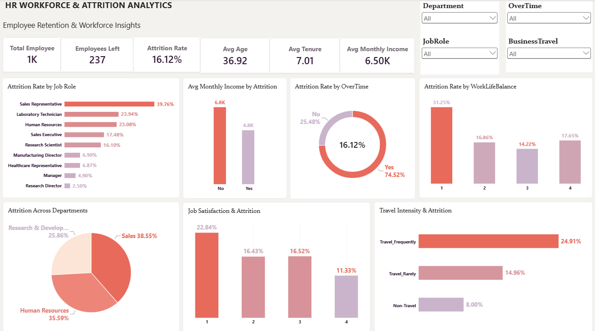

# HR Employee Attrition Analysis

An end-to-end HR Analytics project using Power Query, Python, SQL and Power BI to analyze employee attrition, retention and workforce trends.

## 📊 Dashboard Preview



---

## 🎯 Project Objective

The objective of this project is to analyze employee attrition and identify workforce segments associated with higher employee turnover.

The analysis focuses on:

- Employee attrition and retention
- High-risk job roles and departments
- Overtime and business travel
- Employee satisfaction and work-life balance
- Salary and compensation patterns
- Employee tenure and experience
- Workforce demographics

---

## 🛠️ Tools & Technologies

- **Power Query** – Data cleaning and transformation
- **Python** – Exploratory Data Analysis and statistical analysis
- **SQL** – Data analysis and business queries
- **Power BI** – Interactive dashboard and KPI reporting
- **Pandas, Matplotlib, Seaborn** – Python-based analysis and visualization

---

## 📂 Dataset

The project uses the **IBM HR Analytics Employee Attrition & Performance** dataset.

The dataset contains employee-level information including:

- Employee demographics
- Department and job role
- Salary and job level
- Job satisfaction
- Work-life balance
- Overtime
- Business travel
- Years of experience
- Years at company
- Attrition status

The dataset contains **1,470 employees** and was used for workforce and attrition analysis.

---

## 🧹 Data Cleaning & Transformation

Data cleaning was performed using **Power Query**.

The cleaning process included:

- Removed constant/unnecessary columns
- Checked data types
- Verified missing values
- Checked duplicate records
- Reviewed categorical and numerical fields
- Prepared the cleaned dataset for SQL, Python and Power BI analysis

The final cleaned dataset contains **31 relevant columns**.

---

## 🔍 Python EDA

Python was used to perform exploratory data analysis and identify patterns in employee attrition.

Key areas analyzed:

- Attrition by department
- Attrition by job role
- Attrition by overtime
- Attrition by business travel
- Attrition by job satisfaction
- Attrition by work-life balance
- Attrition by job involvement
- Attrition by age
- Salary differences between employees who left and stayed
- Employee tenure and experience
- Number of previous companies worked

Libraries used:

```text
Pandas
NumPy
Matplotlib
Seaborn
